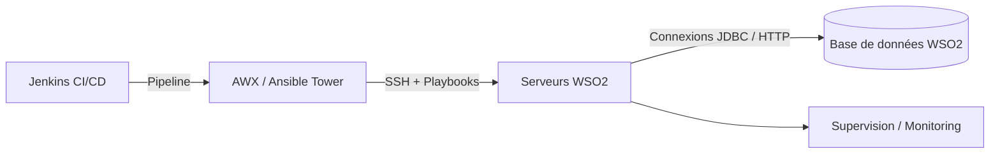
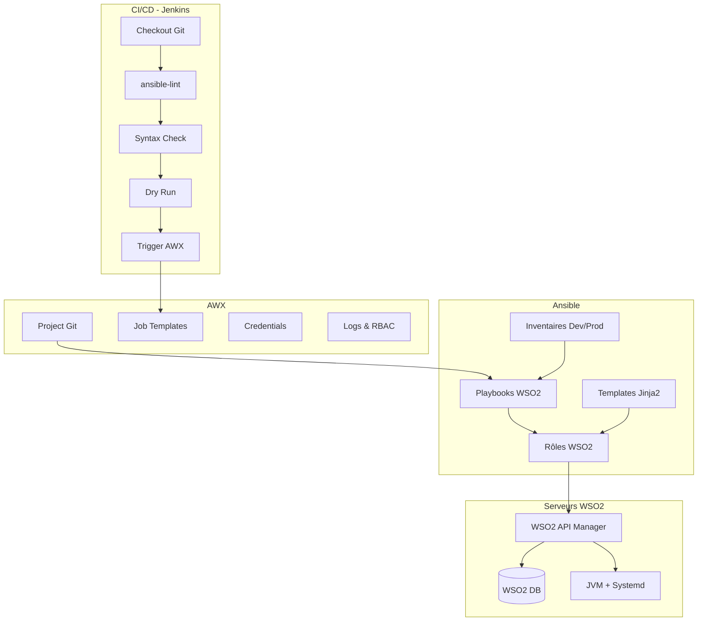

# 🌀 WSO2 Deployment Automation — Ansible + AWX  
### Documentation professionnelle — par **Ahmed GHANMI**


---

## 📌 Description

Ce dépôt fournit une solution **professionnelle et industrialisée** pour le déploiement automatisé de **WSO2 API Manager** avec :

- **Ansible** : installation, configuration et orchestration technique  
- **AWX** : interface graphique, RBAC, scheduling et gestion des credentials  
- **Jenkins** : pipeline CI/CD pour valider et déclencher les déploiements

Le projet suit les bonnes pratiques **Infra as Code**, avec :

- Rôles Ansible idempotents  
- Séparation claire Dev / Preprod / Prod  
- Gestion sécurisée des secrets  
- Rolling update et mécanisme de rollback

Mainteneur : **Ahmed GHANMI**

---

## 🏗️ Architecture globale



---

## 🧩 Architecture interne (technique)



---

## 📁 Arborescence du projet

```bash
infra-wso2-ansible/
├─ inventories/
│  ├─ dev/
│  ├─ preprod/
│  └─ prod/
│     ├─ hosts.yml
│     └─ group_vars/
│        └─ wso2_api_manager.yml
├─ playbooks/
│  ├─ install_wso2_apim.yml
│  ├─ update_wso2_apim.yml
│  └─ rollback_wso2_apim.yml
└─ roles/
   └─ wso2_api_manager/
      ├─ defaults/
      ├─ tasks/
      ├─ handlers/
      ├─ templates/
      ├─ files/
      └─ vars/
```

---

## 🛠 Installation de WSO2 — Étape par étape

### 1️⃣ Pré-requis sur les serveurs WSO2

- OS Linux (RHEL / Rocky / Ubuntu, etc.)  
- Accès SSH depuis AWX / Ansible  
- Java 11 installé (ou géré par Ansible)  
- Archive WSO2 API Manager disponible (ou accessible via HTTP/NFS)

### 2️⃣ Préparation des inventaires

Exemple `inventories/prod/hosts.yml` :

```yaml
all:
  children:
    wso2_api_manager:
      hosts:
        wso2-apim-1.prod.local:
        wso2-apim-2.prod.local:
```

Exemple `inventories/prod/group_vars/wso2_api_manager.yml` :

```yaml
wso2_version: "4.3.0"
wso2_install_dir: "/opt/wso2"
wso2_user: "wso2"
wso2_group: "wso2"

wso2_apim_archive: "/tmp/wso2am-4.3.0.zip"

wso2_db_host: "wso2-db-1.prod.local"
wso2_db_name: "WSO2AM_DB"
wso2_db_user: "wso2am"
# wso2_db_password : injecté via AWX / Jenkins (jamais en clair dans Git)
```

### 3️⃣ Lancement du déploiement WSO2 (local)

```bash
ansible-playbook -i inventories/prod playbooks/install_wso2_apim.yml
```

---

## 🤖 AWX — Configuration étape par étape

### 1️⃣ Project AWX

- Type : **Git**  
- URL : URL du dépôt `infra-wso2-ansible`  
- Branch : `main` (ou autre)  
- Options SCM :  
  - ✅ Update Revision on Launch  
  - ✅ Clean  
  - ✅ Delete on Update  

### 2️⃣ Inventories AWX

- Créer un Inventory `WSO2-PROD`  
- Importer/mappper `inventories/prod/hosts.yml` (SCM ou manuel)

### 3️⃣ Credentials

- **Machine** : pour l’accès SSH aux serveurs WSO2  
- **Secret / Vault** : pour `wso2_db_password`, keystores, etc.  
- Optionnel : **Source Control Credential** si repo privé SSH

### 4️⃣ Job Template

- Name : `Install WSO2 APIM - PROD`  
- Inventory : `WSO2-PROD`  
- Project : `infra-wso2-ansible`  
- Playbook : `playbooks/install_wso2_apim.yml`  
- Credentials : SSH + Secrets  
- Option : Enable privilege escalation (become) si nécessaire  

---

## 📐 Structuration des rôles Ansible

### Rôle `wso2_api_manager`

```bash
roles/wso2_api_manager/
├─ defaults/
│  └─ main.yml
├─ tasks/
│  ├─ main.yml
│  ├─ prereqs.yml
│  ├─ install.yml
│  ├─ config.yml
│  └─ service.yml
├─ handlers/
│  └─ main.yml
├─ templates/
│  ├─ deployment.toml.j2
│  └─ wso2apim.service.j2
└─ files/
```

### Exemple : `defaults/main.yml`

```yaml
wso2_version: "4.3.0"
wso2_install_dir: "/opt/wso2"
wso2_user: "wso2"
wso2_group: "wso2"

wso2_service_name: "wso2apim"
wso2_product_dir: "wso2am-{{ wso2_version }}"
wso2_product_home: "{{ wso2_install_dir }}/{{ wso2_product_dir }}"

wso2_jvm_xms: "2g"
wso2_jvm_xmx: "4g"
```

### Exemple : `tasks/main.yml`

```yaml
- name: Pré-requis WSO2
  include_tasks: prereqs.yml

- name: Installation WSO2
  include_tasks: install.yml

- name: Configuration WSO2
  include_tasks: config.yml

- name: Service WSO2
  include_tasks: service.yml
```

---

## 🔐 Bonnes pratiques Production

### Secrets & sécurité

- ❌ Jamais de mots de passe en clair dans Git  
- ✅ Utilisation de **Credentials AWX** et **Credentials Jenkins**  
- Limiter les accès SSH (clé dédiée Ansible / AWX)  
- Protéger les keystores WSO2 (droits filesystem restreints)

### Système & OS

- Utilisateur dédié `wso2` sans accès shell complet  
- Service systemd dédié (`wso2apim.service`)  
- Logs WSO2 dans un répertoire séparé (`/var/log/wso2/`)

### WSO2 & clustering

- Utiliser les inventaires pour distinguer les rôles (gateway, publisher, etc.)  
- Générer les endpoints via templates Jinja2  
- Placer un Load Balancer (Nginx/HAProxy/F5…) devant le cluster

---

## 🔄 Rolling updates & rollback automatisé

### Rolling update

Playbook d’update typique :

```yaml
- name: Rolling update WSO2 API Manager
  hosts: wso2_api_manager
  serial: 1
  become: yes

  roles:
    - wso2_api_manager
```

- `serial: 1` → met à jour un nœud à la fois  
- Intégration possible avec un script pour retirer/ajouter le nœud au LB

### Rollback

- Conserver les anciennes versions du binaire WSO2 (`/opt/wso2/archive/`)  
- Playbook `rollback_wso2_apim.yml` qui :
  - Replace le répertoire courant par la version n-1  
  - Redéploie la configuration n-1 (si versionnée)  
  - Redémarre le service systemd  

---

## ⚙️ CI/CD avec Jenkins

Ce projet est conçu pour être utilisé avec **Jenkins** comme moteur CI/CD, AWX restant l’exécutant principal des playbooks de déploiement.

### Exemple de Jenkinsfile

```groovy
pipeline {
    agent any

    environment {
        ANSIBLE_CONFIG = "${WORKSPACE}/ansible.cfg"
        INVENTORY = "inventories/prod/hosts.yml"
        PLAYBOOK = "playbooks/install_wso2_apim.yml"
        AWX_TOKEN = credentials('AWX_API_TOKEN')
        AWX_URL = "https://awx.example.com/api/v2/job_templates/15/launch/"
    }

    stages {

        stage('Checkout') {
            steps {
                git branch: 'main',
                    url: 'git@github.com:organisation/infra-wso2-ansible.git'
            }
        }

        stage('Install dependencies') {
            steps {
                sh '''
                pip3 install --user ansible ansible-lint
                '''
            }
        }

        stage('Lint Ansible') {
            steps {
                sh '''
                ansible-lint .
                '''
            }
        }

        stage('Syntax Check') {
            steps {
                sh '''
                ansible-playbook -i ${INVENTORY} ${PLAYBOOK} --syntax-check
                '''
            }
        }

        stage('Dry Run (check mode)') {
            steps {
                sh '''
                ansible-playbook -i ${INVENTORY} ${PLAYBOOK} --check
                '''
            }
        }

        stage('Trigger AWX job') {
            steps {
                sh '''
                curl -k -X POST "${AWX_URL}"                   -H "Content-Type: application/json"                   -H "Authorization: Bearer ${AWX_TOKEN}"                   -d '{"extra_vars": {}}'
                '''
            }
        }
    }

    post {
        success {
            echo "Déploiement WSO2 déclenché avec succès via Jenkins + AWX."
        }
        failure {
            echo "Le pipeline Jenkins a échoué."
        }
    }
}
```

### Credentials Jenkins nécessaires

| ID              | Type        | Usage                                  |
|-----------------|-------------|----------------------------------------|
| `AWX_API_TOKEN` | Secret text | Authentifier les appels API vers AWX  |
| Clé SSH Git     | SSH Key     | Cloner le dépôt Ansible en SSH        |

---

## 🧪 Exemple de playbook complet

`playbooks/install_wso2_apim.yml` :

```yaml
- name: Installer et configurer WSO2 API Manager
  hosts: wso2_api_manager
  become: yes

  vars:
    # Peut être injecté via AWX/Jenkins
    wso2_db_password: "{{ lookup('env', 'WSO2_DB_PASSWORD') | default('CHANGER_MOI', true) }}"

  roles:
    - wso2_api_manager
```

---

## 🧱 Exemple de rôle — extraits clés

### `tasks/prereqs.yml`

```yaml
- name: Créer le groupe wso2
  group:
    name: "{{ wso2_group }}"
    state: present

- name: Créer l'utilisateur wso2
  user:
    name: "{{ wso2_user }}"
    group: "{{ wso2_group }}"
    create_home: no
    system: yes

- name: Installer Java 11
  package:
    name: java-11-openjdk
    state: present
```

### `tasks/install.yml`

```yaml
- name: Créer le répertoire d'installation WSO2
  file:
    path: "{{ wso2_install_dir }}"
    state: directory
    owner: "{{ wso2_user }}"
    group: "{{ wso2_group }}"
    mode: "0755"

- name: Décompresser WSO2 APIM si absent
  unarchive:
    src: "{{ wso2_apim_archive }}"
    dest: "{{ wso2_install_dir }}"
    creates: "{{ wso2_product_home }}"
    remote_src: yes
  notify: restart wso2
```

### `tasks/config.yml`

```yaml
- name: Déployer deployment.toml
  template:
    src: "deployment.toml.j2"
    dest: "{{ wso2_product_home }}/repository/conf/deployment.toml"
    owner: "{{ wso2_user }}"
    group: "{{ wso2_group }}"
    mode: "0640"
  notify: restart wso2
```

### `tasks/service.yml`

```yaml
- name: Déployer le service systemd WSO2
  template:
    src: "wso2apim.service.j2"
    dest: "/etc/systemd/system/{{ wso2_service_name }}.service"
    owner: root
    group: root
    mode: "0644"
  notify: daemon-reload

- name: Activer et démarrer le service WSO2
  systemd:
    name: "{{ wso2_service_name }}"
    state: started
    enabled: yes
```

### `handlers/main.yml`

```yaml
- name: daemon-reload
  systemd:
    daemon_reload: yes

- name: restart wso2
  systemd:
    name: "{{ wso2_service_name }}"
    state: restarted
```

---

## 🗺️ Roadmap détaillée

- [ ] Ajout d’un rôle `wso2_identity_server` complet  
- [ ] Automatisation de la gestion des keystores et certificats  
- [ ] Intégration monitoring (Prometheus / Grafana / Loki)  
- [ ] Tests de rôles avec Molecule + Docker  
- [ ] Support de topologies multi-datacenters WSO2  

---

## 👤 Auteur

**Ahmed GHANMI**  
DevOps Engineer — Automation — Ansible — WSO2 — AWX — Jenkins  

---

## 📝 Licence

Usage interne — libre d’adaptation selon les besoins de l’entreprise.
